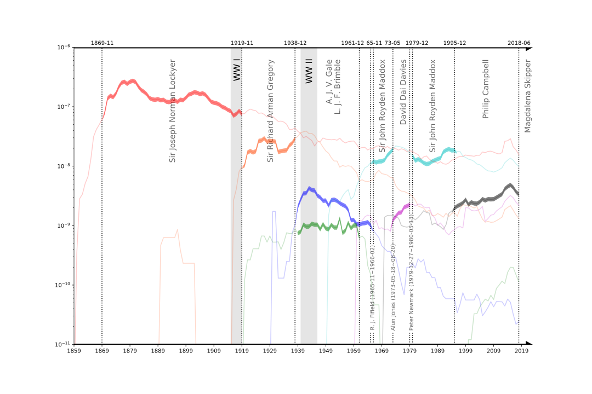

# Legends of *Nature* and Editors-in-chief
This year marks the 150th celebration of _Nature_. However, the understanding of the way the army of unsung editors-in-chief has strengthened and enriched the integrity and quality of the journal under the umbrella of its original mission remains nominal rather than substantial. This paper scrutinizes the chief vehicle guided by _Nature_’s doctrine with regard to the ways it has conflicted with the advancement of both science and social progress. We first recast quantitative spatiotemporal analysis on the diachronic discourse of _Nature_ since its debut, which promises to articulate the unfolding chronological picture of _Nature_ on a historical time scale, and pinpoint overdue corrective to the strongly-held but flawed notions on editors-in-chief of _Nature_. Our findings strongly indicate that the army of editors-in-chief have never met with their fair share of identification, and they took on the challenge guided by _Nature_’s doctrine with extraordinary polymath, unparalleled enthusiasm and diverse characters.
# 150 years of *Nature*

**Figure** The chronological account of the dedicated editors-in-chief of *Nature* is a faithful mirror of this renowned “*weekly illustrated journal of science*”. The scientific fame curves between 1859 and 2008 are facsimiled according to the n-gram frequency in the Google Books Corpus, and those after 2008 are obtained from the Google Scholar search engine due to the coverage of the Google Books n-gram database. Our findings indicate that Sir Joseph Norman Lockyer (red), Sir Richard Arman Gregory (orange), Lionel John Farnham Brimble (blue), Arthur J. V. Gale (green), Sir John Royden Maddox (cyan), David Dai Davies (magenta) and Philip Campbell (black) enjoyed fame and reputation during their tenures, and the collective memory of these unsung journalists has both short-term and long-term components.
# Citation
Zhiwen Hu, Chuhan Wu, Zhongliang Yang, Yongfeng Huang. Legends of _Nature_ and Editors-in-chief. ArXiv, 2019, https://arxiv.org/abs/1910.11208. 
